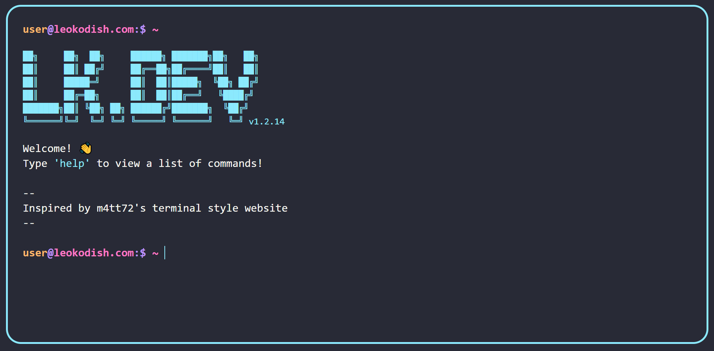

# Terminal Emulator Inspired Website

## Background

My personal website was due for a redesign, honestly a complete tear down and reconstruction so I took the opportunity to rewrite the entire thing.

This project was also a good opportunity to leverage more powerful tools than I had used on my previous website. My last site was just pure HTML, CSS, and some JS, so for this project I used ReactJS, TypeScript, Webpack (came configured through Create-React-App), and TailwindCSS.

Messing around with the terminal emulator on MacOS when I was a kid was my introduction to command line interfaces and interacting with an OS in this way helped start my interest in computers and programming.
This website is designed as a love letter to that, serving as an interactive resume to share my work experience, side projects, and external links.

While researching design inspiration I came across [m4tt72's open source terminal project](https://github.com/m4tt72/terminal) on GitHub and it was pretty much exactly what I was imagining in terms of what I wanted my new website to look like. Using that project as a reference I built this website and added more features that I wanted like changing color themes, text art, and a Neofetch inspired tool about myself that I call "Leofetch".

## Hosting

My previous website was hosted using GitHubPages, but this time I used Vercel as the hosting and deployment process was incredibly smooth. All I had to do was connect my GitHub repository to Vercel and deploy this project. I was also able to easily customize the build and deploy process such as removing sourcemaps from being sent to production through the Vercel deployment dashboard. Transfering the leokodish.com domain name to point to the Vercel production deployment was also a breeze.

## Testing

I used Jest to test TypeScript utility functions I wrote for doing things like tokenizing input and checking if an inputted command is valid.
I also used Google Lighthouse to audit the performance, responsiveness, and accessbility of this web page.
